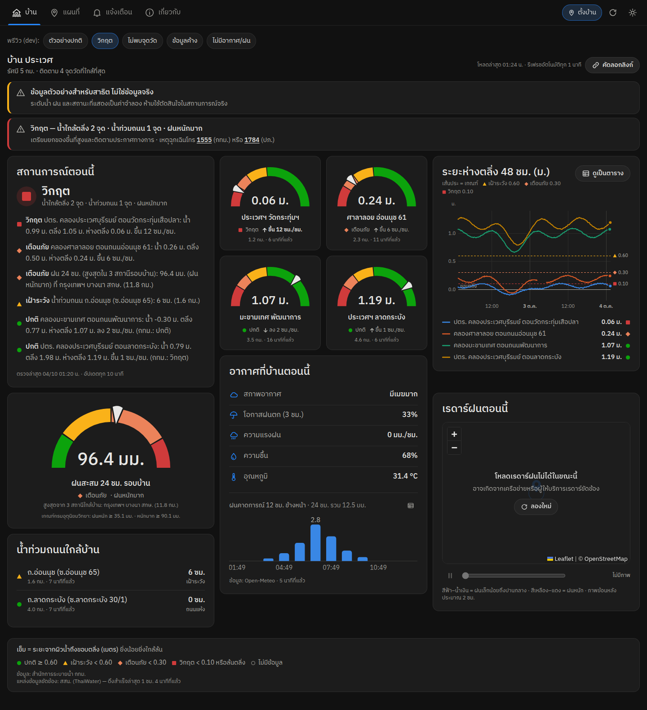

# Flood Monitor — ระบบเฝ้าระวังและแจ้งเตือนภัยน้ำท่วมตามตำแหน่งของคุณ

ติดตามระดับน้ำคลอง **ระยะห่างตลิ่ง** ฝนสะสม น้ำท่วมถนน สภาพอากาศ และเรดาร์ฝน รอบ ๆ ตำแหน่งที่ผู้ใช้กำหนด
แสดงเป็นแดชบอร์ดสไตล์ Home Assistant และแจ้งเตือนผ่าน Web Push / LINE / Telegram / ntfy / อีเมล / Discord เมื่อสถานการณ์เปลี่ยน

ข้อมูลจาก **สำนักการระบายน้ำ กรุงเทพมหานคร**, **คลังข้อมูลน้ำแห่งชาติ (ThaiWater, สสน.)**, **กรมทรัพยากรน้ำ**, **Open-Meteo** และ **RainViewer**



> ใช้ประกอบการตัดสินใจเท่านั้น ไม่ใช่ประกาศเตือนภัยทางการ — ติดตามประกาศ กทม. (สายด่วน 1555), ปภ. (1784), กรมอุตุนิยมวิทยา (1182)

## ความสามารถ

- **กำหนดตำแหน่งได้ 3 วิธี**: แตะบนแผนที่, ใช้ GPS ของอุปกรณ์, วางพิกัด/ลิงก์ Google Maps — ระบบเลือกจุดวัดที่ใกล้ที่สุดในรัศมีที่กำหนด (0.5–20 กม., 1–8 จุด)
- **แดชบอร์ด**: สถานการณ์ตอนนี้ (สรุปเป็นข้อความไทย), gauge ระยะห่างตลิ่งพร้อมแนวโน้ม ซม./ชม., กราฟ 48 ชม. (มีมุมมองตาราง),
  อากาศที่บ้าน + ฝนคาดการณ์ 12 ชม., เรดาร์ฝนเคลื่อนไหว, ฝนสะสม 24 ชม. (เกณฑ์กรมอุตุฯ), น้ำท่วมถนนใกล้บ้าน, ป้ายเตือนเมื่อข้อมูลค้าง
- **แผนที่จุดวัด** ทั้งหมดแยกสีตามระดับ (รูปทรงต่างกันทุกระดับ — ไม่พึ่งสีอย่างเดียว) กรองตามประเภท ซ้อนเรดาร์ฝนได้
- **กล้อง CCTV ใกล้บ้าน**: ภาพนิ่งจากกล้องเฝ้าระวังน้ำท่วมของสำนักการระบายน้ำ กทม. (~877 ตัว ตรงจุดวัดน้ำบนถนน อัปเดตราว 1–3 นาที)
  และกล้องสถานีแม่น้ำของกรมทรัพยากรน้ำ (ถ่ายภาพราวทุก 15 นาที) ดูบนแดชบอร์ด แผนที่ และหน้าดูภาพ — ใช้ประกอบเท่านั้น สถานะมาจากเซ็นเซอร์วัดน้ำ ไม่ได้มาจากภาพ ([รายละเอียด](docs/DATA-SOURCES.md#กล้อง-cctv))
- **แจ้งเตือนอัจฉริยะ**: แจ้งเมื่อยกระดับ/คลี่คลาย (มี hysteresis), น้ำขึ้นเร็ว (คาดการณ์เวลาถึงระดับเฝ้าระวัง), ฝนหนัก, น้ำท่วมถนน,
  ย้ำเตือนเมื่อยังวิกฤต — รวมเป็นข้อความเดียวต่อรอบ ไม่แจ้งจากข้อมูลค้าง ([รายละเอียด](docs/ALERTS.md))
- **ไม่ต้องสมัครสมาชิก**: ใช้ manage token ที่เก็บในเบราว์เซอร์ + ลิงก์จัดการ
- **PWA**: ติดตั้งลงหน้าจอโฮมได้, รองรับธีมมืด/สว่าง, ใช้งานบนมือถือได้เต็มรูปแบบ
- **ทนทาน**: กรองค่าผิดปกติของเซนเซอร์ (−99, −2.00, ตลิ่ง 0, เกณฑ์เป็นซม.), รวมสถานีซ้ำระหว่าง กทม. กับ ThaiWater, ดึงข้อมูลแบบสุภาพ (ไม่ยิงพร้อมกัน, retry)

## เริ่มต้นใช้งานเร็ว (ข้อมูลสาธิต)

[](https://codespaces.new/chalaivate/flood-monitor/tree/claude/flood-early-warning?quickstart=1)

กดปุ่มด้านบนเพื่อรันบน GitHub Codespaces โดยไม่ต้องติดตั้งอะไร — ครั้งแรกใช้เวลาสร้างและ build ราว 3–5 นาที แล้วหน้าเว็บจะเปิดเอง
(หรือแท็บ PORTS → พอร์ต 3000) · ลิงก์เดิมจะพากลับไป codespace ที่สร้างไว้แล้ว ไม่สร้างซ้ำ

หรือรันในเครื่อง (macOS / Linux / Windows):

```bash
npm ci
npm run demo            # build + เปิดเซิร์ฟเวอร์พร้อมข้อมูลสาธิต → http://localhost:3000
npm run demo -- --live  # ใช้ข้อมูลจริง (ข้อมูล กทม. ได้เฉพาะเครื่องที่อยู่ในไทย)
```

ต้องใช้ Node.js 22.13+ — โหมดสาธิตใช้จุดวัดจริงแต่ค่าทั้งหมดเป็นค่าจำลอง (มีป้ายแจ้งบนหน้าเว็บ)
สำหรับพัฒนาโค้ด: `DATA_MODE=fixture EMBEDDED_WORKER=1 npm run dev`

## ใช้งานจริง

endpoint ของ กทม. ตอบเฉพาะ IP ในประเทศไทย จึงแนะนำให้รัน **Docker บนเครื่องในไทย** (PC ออฟฟิศ / mini PC / NAS / VPS ไทย):

```bash
cp .env.example .env && mkdir -p data && sudo chown 1000:1000 data
docker compose up -d --build
```

หรือใช้ **Vercel + Supabase** สำหรับหน้าเว็บ (รันทุกไฟล์ใน `supabase/migrations/` ตามลำดับ) และให้เครื่องในไทยรัน `npm run worker` ดึงข้อมูล
— ดูทุกรูปแบบใน [docs/DEPLOY.md](docs/DEPLOY.md)

Web Push, ปุ่มใช้ตำแหน่งของฉัน และ webhook ของ LINE/Telegram ต้องเปิดผ่าน **HTTPS** (เช่น Cloudflare Tunnel) — `http://localhost` ใช้ทดสอบได้

## โครงสร้าง

```
src/lib/sources/   adapter ต่อแหล่งข้อมูล (bma-canal, bma-misc, thaiwater, demo)
src/lib/engine/    คำนวณระดับ, snapshot ของแดชบอร์ด, กฎแจ้งเตือน (pure functions)
src/lib/pipeline.ts รอบดึงข้อมูล → บันทึก → ประเมิน → ส่งแจ้งเตือน
src/lib/store/     SQLite (node:sqlite) และ Supabase
src/lib/notify/    Web Push, LINE, Telegram, ntfy, อีเมล (Resend), Discord
src/app/api/       API (snapshot, stations, history, places, channels, webhooks, cron, ingest, health)
src/app/, src/components/  หน้าเว็บ (Next.js 16 App Router + Tailwind 4)
worker/poll.ts     ตัวดึงข้อมูลแบบแยกโปรเซส (--once, --relay)
supabase/migrations/  schema สำหรับ Supabase
```

เอกสารเพิ่มเติม: [สถาปัตยกรรม](docs/DESIGN.md) · [แหล่งข้อมูล](docs/DATA-SOURCES.md) · [การแจ้งเตือน](docs/ALERTS.md) · [การติดตั้ง](docs/DEPLOY.md)

## พัฒนา

```bash
npm test          # vitest (ใช้ข้อมูลจริงที่บันทึกไว้ใน tests/fixtures)
npm run typecheck
npm run lint
npm run build
npm run worker:once   # ดึงข้อมูลหนึ่งรอบ
npm run --silent vapid   # สร้างกุญแจ Web Push
```

## ที่มาของข้อมูลและเงื่อนไข

- สำนักการระบายน้ำ กรุงเทพมหานคร — ระดับน้ำคลอง ฝน น้ำท่วมถนน สถานีสูบน้ำ เรดาร์ (API ภายในของเว็บไซต์ ไม่ใช่ API ทางการ)
- คลังข้อมูลน้ำแห่งชาติ / สถาบันสารสนเทศทรัพยากรน้ำ (องค์การมหาชน) — ข้อมูลทวนของ กทม. และข้อมูลทั่วประเทศ
- Open-Meteo (CC BY 4.0) · RainViewer · © OpenStreetMap contributors

ก่อนเปิดให้บริการสาธารณะควรขออนุญาตหน่วยงานเจ้าของข้อมูล — รายละเอียดใน [docs/DATA-SOURCES.md](docs/DATA-SOURCES.md)
